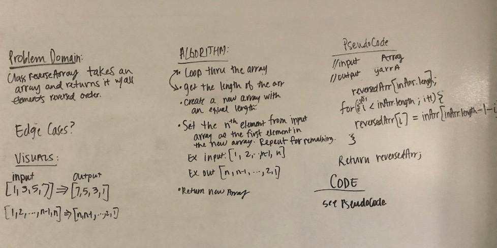

# Array Reverse

## Challenge
Given an array, reverse the order of all the elements in the array. 

## Approach & Efficiency
The first way I approached this was to create a new array and loop through the original array and insert the last elements as the first elements in the array. Time and space will be affected linearly as the array grows in length. 

The second approach I had was to modify the array in-place, by creating a placeholder that switches the first and last elements at the same time and only iterates through half of the array. Time is cut in half, memory remains the same as the array gorws in length. 

## Solution
