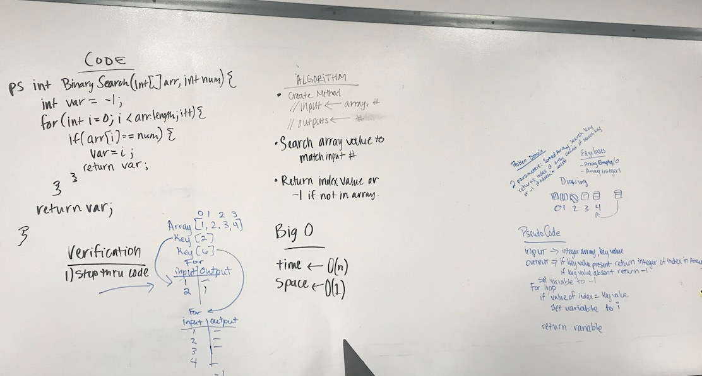

# Binary Search 
## Challenge
The challenge is to write a function that takes in a sorted array and an element to find in the array. If the element is not in the array, the function returns -1, otherwise the index position is returned. 

## Approach & Efficiency
My first solution was to loop through the whole array and check each element against the input key element. Once it matches, the index is returned; otherwise -1 is returned. At this rate, the Big O for time is linear O(n) and for space it is constant O(1).

My future approach is to solve the problem using the half-interval search method.

## Solution
