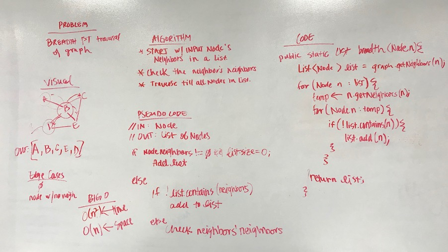

# Breadth-First Traversal
## The Challenge
Write a method that takes in a `node` and outputs a list of a breadth-first traversal from the input node.

## Approach & Efficiency
My original apporach was to loop though the list of neighbor nodes of the input node, then add the neighbors of those node if they were not in the new list.

Method | Description | Time | Space
--- | ---- | ---- | ----
`Graph.breadthFirst(Node n)` | This method returns a breadth-first list of nodes from a graph traversal. | *O(dn)* | *O(n)*
**d* = degree of the node (neighbors)

## Solution
[Code](../src/main/java/graph/Graph.java) | [Tests](../src/test/java/graph)

