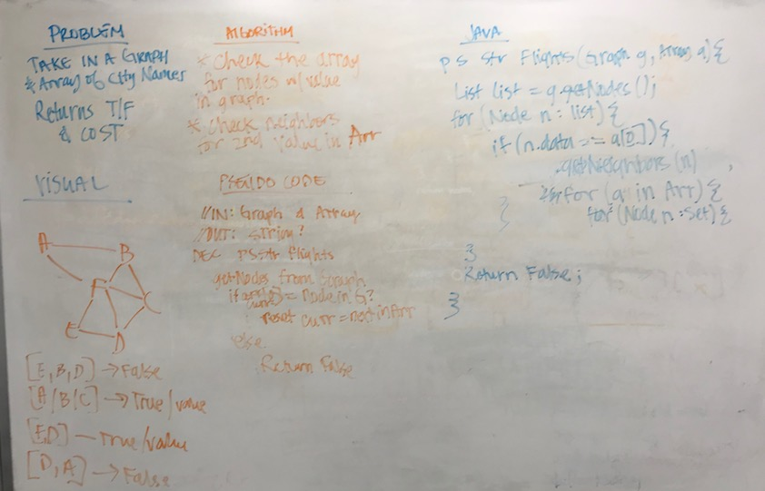

# Flight Itinerary
## The Challenge
- Given a business trip itinerary, and an Alaska Airlines route map, is the trip possible with direct flights? If so, how much will the total trip cost be?
- Write a function based on the specifications above, which takes in a graph, and an array of city names. Without utilizing any of the built-in methods available to your language, return whether the full trip is possible with direct flights, and how much it would cost.

## Approach & Efficiency
My approach was to create a new class `FlightFinder` and loop through the input array. Find a node in the array and check to see if the next element in the array is in the set of neighbors for the node.

### GetEdge Class
Method | Description | Time | Space
---- | ---- | ---- | ----

## Solution
[Code]() | [Test]()

