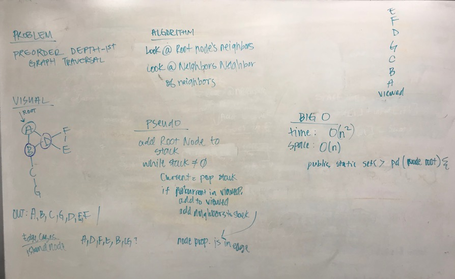

# Pre-order Depth-First Traversal
## The Challenge
Conduct a depth first preorder traversal on a graph.

## Approach & Efficiency
My approach for this challenge was to add the root node to a stack. While my stack is empty, I pop the stack and check to see if I have viewed the node. If I haven't, I add it to my viewed set, then I add the neighbors of that node to my stack.

### Graph Class
Method | Description | Time | Space
---- | ---- | ---- | ----
`Graph.depthFirst(Node n)` | This method returns a pre-ordered-depth-first list of nodes from a graph traversal. | *O(dn)* | *O(n)* 

**d* = degree of the node (neighbors)

## Solution
[Code](../src/main/java/graph/Graph.java) | [Tests](../src/test/java/graph/GraphTest.java)

