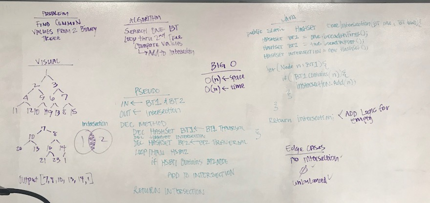

# Intersecting Binary Trees
## The Challenge
Find common values in 2 binary trees.

## Approach & Efficiency
My approach was to create a `HashSet` for each `Binary Tree` and the intersection of the two trees. I would then loop through the first set of `Nodes` checking against the second set of nodes. If it is in both sets, I would then add the node to the `Intersection` set.

Method | Description | Time | Space
--- | --- | ---- | ----
`.intersection(BinaryTree one, BinaryTree two)` | This returns the set of values in both Binary Trees. | `O(n)` | `O(n)`
`.toSet(BinaryTree input)` | This method returns a BinaryTree traversal into a Set. | `O(n)` | `O(n)`

## The Solution
[Code](../src/main/java/hashTable/treeIntersection) | [Test](../src/test/java/hashTable/treeIntersection)

