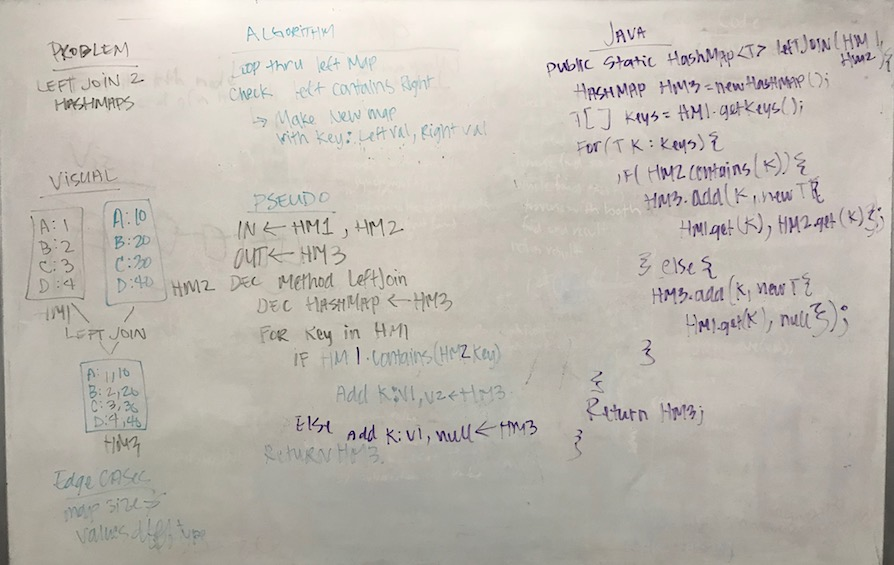

# Left Joins
## The Challenge
Implement a simplified LEFT JOIN for 2 Hashmaps.

## Approach & Efficiency
My approach to this problem was to get the `keys` from the left map and loop through them. For each key, I check if it is in the right map and add the `key`, `values` to a new `HashMap`.

Method | Description | Time | Space
--- | --- | ---- | ---
`.leftJoin(HashMap left, HashMap right)` | This method joins the `key`,`value` pairs of two `HashMaps` to the  `key` pairs of the left `Map`. | `O(n)` | `O(n)`

## Solution
[Code](../src/main/java/hashTable/leftJoin) | [Test](../src/test/java/hashTable/leftJoin)

