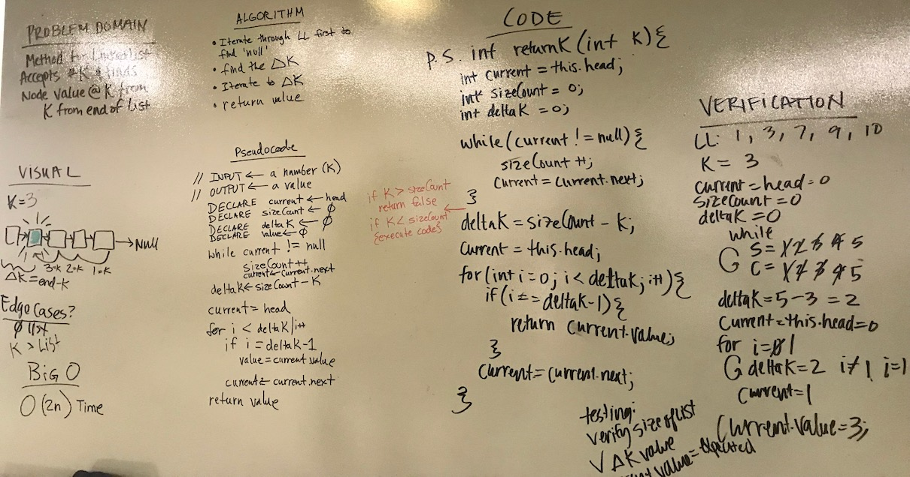

# Linked List Part 3

## The Challenge
Write a method that takes in an value k and returns the kth value from the end.

## Approach & Efficiency
My approach for this was to traverse the list and find the size. Once I found the size I subtracted k. Then traversed the list until I reached k.
For testing, I checked every position of k against the value I expected. I also checked for negative k values, and values of k larger than the list.

Method | Time | Space
---- | ---- | ----
`.kFromEnd(int value)` | O(n) | O(1)

## Solution
[Code](../src/main/java/linkedList) | [Tests](../src/test/java/linkedList/LinkedListTest.java)

