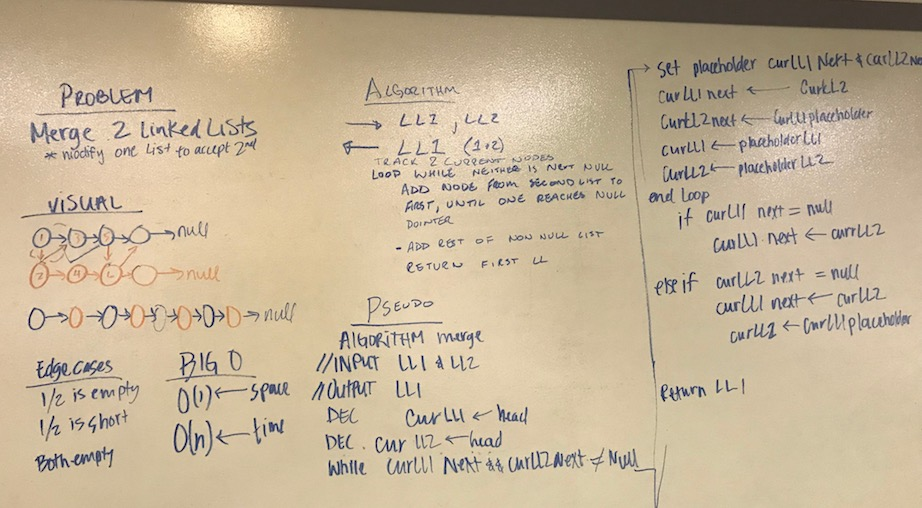
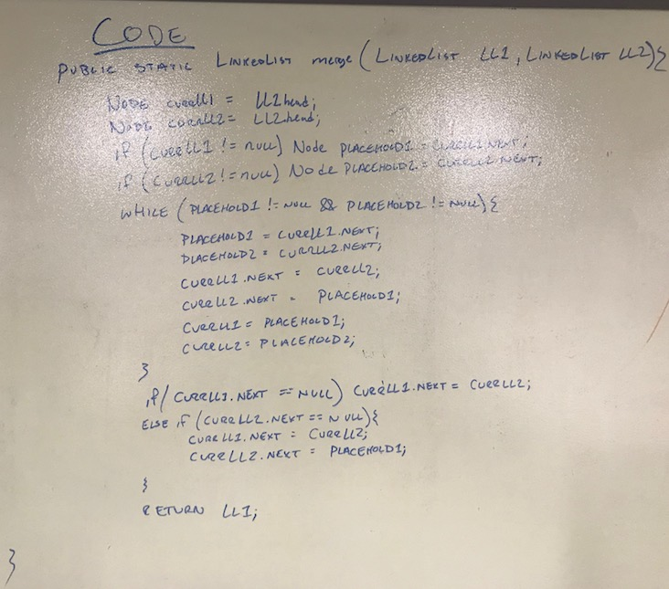

# Linked List Part 4

## The Challenge
Given two linked list, write a method that zipper-merges the two lists.

## Approach & Efficiency
My approach for this was to create a method and using place holders, traverse the lists and swap pointers for each node.

Method | Time | Space
---- | ---- | ----
`.merge(linkedList one, linkedList two)` | O(n) | O(1)

## Solution
[Code](../src/main/java/linkedList) | [Tests](../src/test/java/linkedList/LinkedListTest.java)

