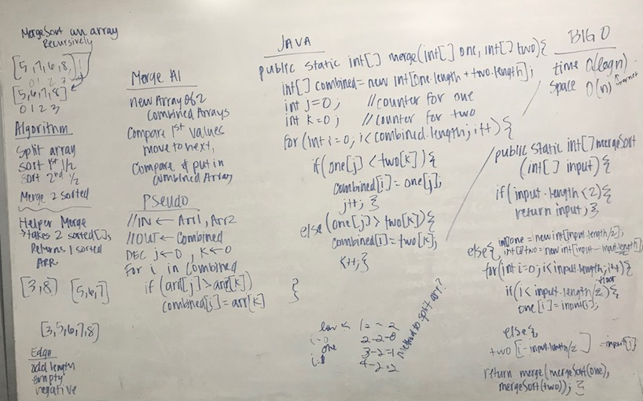

# Merge Sort
## The Challenge
Implement Mergesort recursively.

## Approach & Efficiency
My approach was to create a helper `merge` method to combine 2 sorted arrays.

Method | Description | Time | Space
--- | --- | --- | ---
`.merge(int[] one, int[] two)`  | This method merges two sorted arrays. | `O(n)` | `O(n)`
`.mergeSort(int[])` | This method sorts the input array recursively. | `O(n*log(n))` | `O(n)`

## Solution
[Code](../src/main/java/sorts/mergeSort) | [Test](../src/test/java/sorts/mergeSort)

