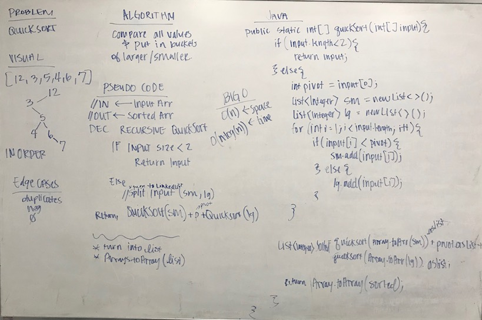

# Quick Sort
## The Challenge
Implement Quick Sort.

## Approach & Efficiency
My approach was to set the base case for a an input array of length one. Otherwise, I split the input array into a larger half and a smaller half, recursing over each section. I then add the smaller sorted array, the pivot, and the larger sorted array together and return it.

Method | Description | Time | Space
---- | ---- | ---- | ---
`.quickSort(int[] array)` | This method sorts an input array recursively. | `0(n*log(n))` | `0(n)`
`.toList(int[] array)` | This method is a helper method for `QuickSort`, it turns an `int[]` and returns a `List<Integers>` | `O(n)` | `O(n)`
`.listToArray(int[] array)` | This method is a helper method for `QuickSort`, it turns a `List<Integers>` and returns an `int[]` | `O(n)` | `O(n)`

## Solution
[Code](../src/main/java/sorts/quickSort) | [Test](../src/test/java/sorts/quickSort)

