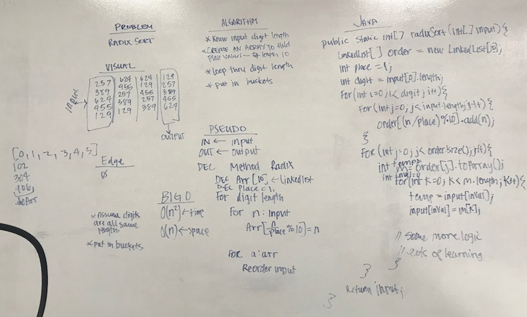

# Radix Sort
## The Challenge
Implement Radix Sort

## Approach & Efficiency
My approach was to get the number of digits, `k`, and loop through the input array `k` times. Each time putting a value into a `List` with the comparable value. Then pulling the values out of that list and storing them in the original array. Once the loop is complete, I return the result array.

Method | Description | Time | Space
---- | ----- | ---- | ----
`.radixSort(int[] array)` | This method returns an array with the values sorted in ascending order. | `O(n)` | `O(n)`
`.listToArray(LinkedList[] list, int[] input)` | This method takes a list and returns an array. | `O(n)` | `O(n)`
`.instantiateLL(LinkedList[] list)` | This method instantiates the `LinkedList` array | `O(n)` | `O(n)`

## Solution
[Code](../src/main/java/sorts/radixSort) | [Test](../src/test/java/sorts/radixSort)

