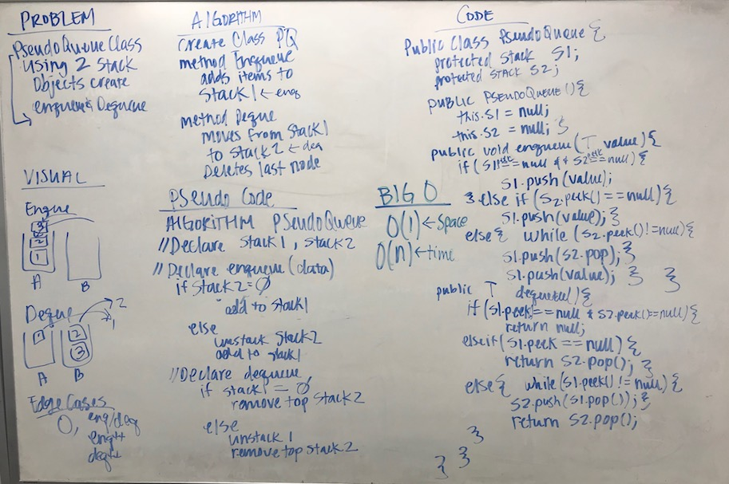

# Stacks and Queues Part 2
## The Challenge
Create a brand new PseudoQueue class. Do not use an existing Queue. Instead, this PseudoQueue class will implement the standard queue interface, but will internally only utilize two Stack objects.

## Approach & Efficiency
My approach was to basically create a slinky between the two stacks. One stack would be intended to hold all the values for enqueuing and then push the whole stack into another stack and pop the top off for dequeuing.

Time | Space
--- | ---
O(n) | O(1)

## Solution
[Code]() | [Test]()
