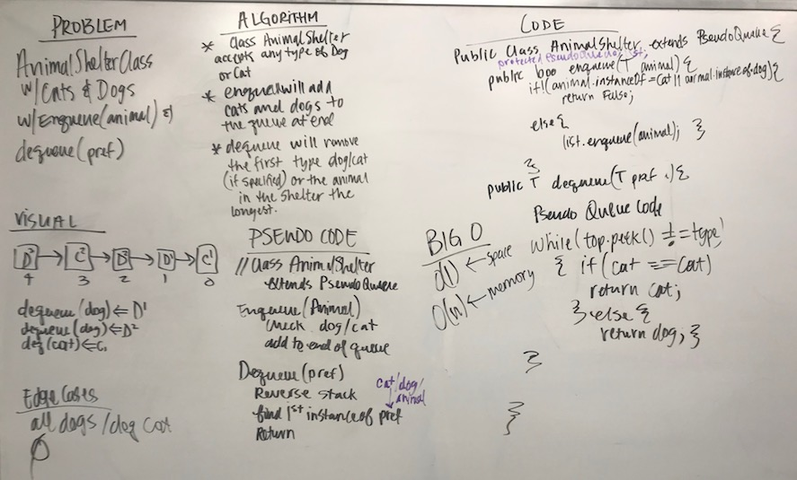

# Stacks and Queues Part 3
## The Challenge
- Create a class called AnimalShelter which holds only dogs and cats. The shelter operates using a first-in, first-out approach.
- The class should have an `.enqueue(animal)` method to add a cat or dog to the queue.
- The class should have a `.dequeue(pref)` method to return the first cat/dog in the queue. Otherwise it returns the first animal in the queue.

## Approach and Efficiency
My original approach was to make a pseudo queue because I wanted to be able to return the animal in the shelter the longest--but that is for another day. My approach was then to create a class that had two queues, one for cats and one for dogs. I then overloaded the enqueue and dequeue methods for Cats and Dogs.
Time | Memory
--- | ---
O(n) | O(1)

## Solution
[Code](../src/main/java/StacksAndQueues/AnimalShelter.java) | [Tests](../src/test/java/StacksAndQueues/AnimalShelterTest.java)
