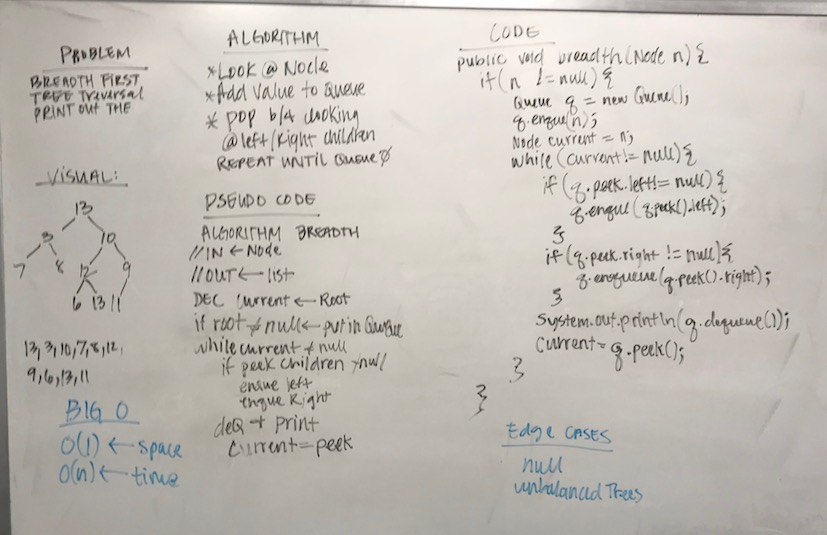

# Trees Part 3
## The Challenge
Write a breadth first traversal method which takes a Binary Tree as its unique input. Without utilizing any of the built-in methods available to your language, traverse the input tree using a Breadth-first approach; print every visited node’s value.

## Approach & Efficiency
My approach for this was to traverse the tree and for each node. Add the node to the queue then check the front of the queue and if the left/right nodes are not null, then add those nodes to the queue. Also to dequeue the front and print the value.

Time | Space
---- | ------
`O(n)` | `O(n)`

## Solution
[Code](../src/main/java/tree/BinaryTree.java) | [Tests](../src/test/java/tree/BinaryTreeTest.java)

