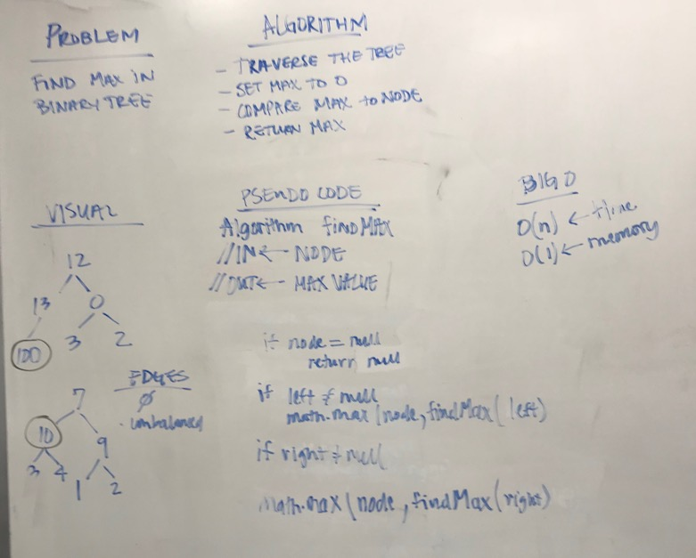

# Trees Part 4
## The Challenge
Write a method called `find-maximum-value` which takes binary tree as its only input. Without utilizing any of the built-in methods available to your language, return the maximum value stored in the tree. You can assume that the values stored in the Binary Tree will be numeric.

## Approach & Efficiency
My approach was to recurse through the tree and to return the max value of the node compared to the previous max value returned.

Time | Memory
---- | -----
`O(n)` | `O(1)`

## The Solution
[Code](../src/main/java/tree/BinaryTreeTest.java) | [Test](../src/test/java/tree/BinaryTreeTest.java)

